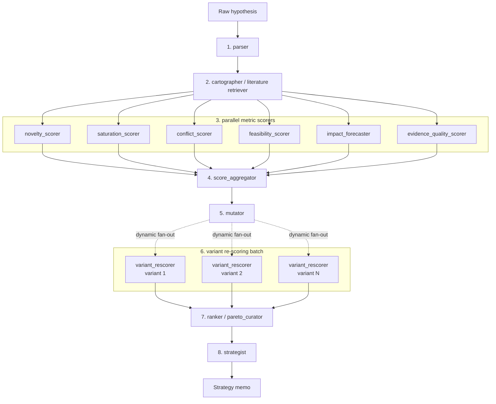

# Agent Connection Schematic

This is the current quantitative Idea Hater backend graph in `backend/pipeline.py`.

## Connection Table

| Step | Node | Reads | Writes |
| --- | --- | --- | --- |
| 1 | `parser` | `raw_hypothesis` | `parsed` |
| 2 | `cartographer` | `raw_hypothesis`, `parsed` | `papers` |
| 3a | `novelty_scorer` | `parsed`, `papers` | `metric_scores` |
| 3b | `saturation_scorer` | `parsed`, `papers` | `overlaps`, `metric_scores` |
| 3c | `conflict_scorer` | `parsed`, `papers` | `conflicts`, `metric_scores` |
| 3d | `feasibility_scorer` | `parsed`, `papers` | `metric_scores` |
| 3e | `impact_forecaster` | `parsed`, `papers`, `conflicts`, `overlaps` | `forecast`, `metric_scores` |
| 3f | `evidence_quality_scorer` | `papers`, upstream evidence | `metric_scores` |
| 4 | `score_aggregator` | `metric_scores`, evidence objects | `scorecard` |
| 5 | `mutator` | `raw_hypothesis`, `parsed`, `scorecard`, evidence | `variants` |
| 6 | `variant_rescorer` | one `current_variant`, scorecard, evidence | `rescored_variants` |
| 7 | `ranker` | `rescored_variants` or `variants` | `ranked_variants`, ranked `variants` |
| 8 | `strategist` | full scored/ranked state | `final_memo` |

## Parallelism

- The six metric scorers run in parallel after `cartographer`.
- Variant re-scoring uses LangGraph dynamic fan-out: one `variant_rescorer` call per generated variant.
- Group emulation is not on this critical path.

## Current Implementation Status

- `impact_forecaster` and `mutator` have real backend modules with deterministic fallback behavior.
- Most other nodes still use pipeline stubs until real implementations land.
- `cartographer` currently returns mock papers, so literature API calls are not yet on the critical path.
